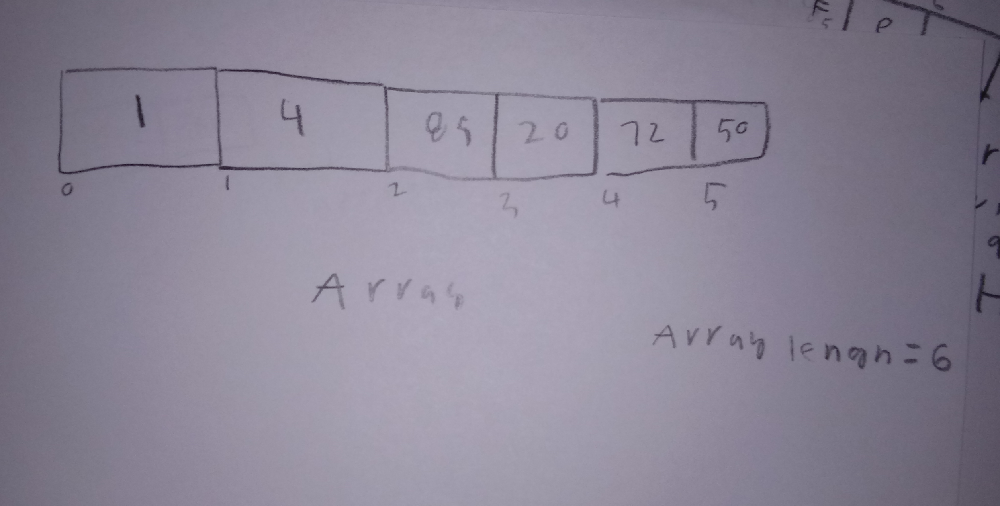

# Array


An array is an ordered collection of elements stored contiguously in memory.  When a new elements is added to an array the size of the array increase and all values are indexable. 


# In Memory

In memory, an array looks like this:



This is a model of an array in memory with 6 elements. 

# Operations

An array supports the following operations:

* Accessing an array is O(1) because the location for the value is known, the retrieval process is equal for every element in an array.  
* Searching and inserting and deleting in an array is O(n) because iteration is needed to get to the desired location.   


# Use Cases

An array is a very basic but a versatile data structure that has many uses. Typically, it used when storing sequential data and when indexing is useful.

An array is not the best choice when sorting is needed or constant searching or frequent deletion and addition happen rapidly as this would not be efficient.    

# Example

```
test = []
test.append(1)#adds to test
test.append(2)#adds to test
test.append(3)#adds to test
test.pop()#removes the last element 
print(test[1])

```

(c) 2018 YOUR NAME. All rights reserved.
