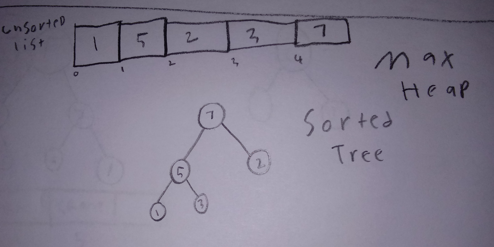

# \[Widget\]

A binary heap is a type of complete binary tree in which has two distinct types, a min heap and a max heap. In a min heap, the root node must be smaller then it’s children which recursively effects every node. In am max heap, the root node must be bigger then it’s children which recursively effects every node.  The nodes of a binary heap can be represented and stored in a list.

# In Memory

In memory, a \[widget\] looks like this:

\[sketch or diagram\]

This is a diagram of a max heap being made from a list of values. The tree down below is sorted according the max heap function.  

# Operations

A \[widget\] supports the following operations:

* Because of the sorting algorithms involved a min or max heap, it is always kept balanced and because of this, when traversing down a min or max heap half of the tree gets ignored because it is either less or greater then search value recursively. For insertion and deletion, This then becomes O(log(n)).  
* searching and accessing a binary heap is O(n) because it is only partially sorted it sill needs iteration  

# Use Cases

Because the top value will be the largest for a maxheap and smallest for a minheap, a min or max heap is very useful when you need quick access the largest or the smallest node in the tree. It is also used in a priority que. .

 

# Example

```
sample code showing creation, and exercising all of the operations
or
a program that doesn't use the structure, and then a version that does
```

(c) 2018 YOUR NAME. All rights reserved.

