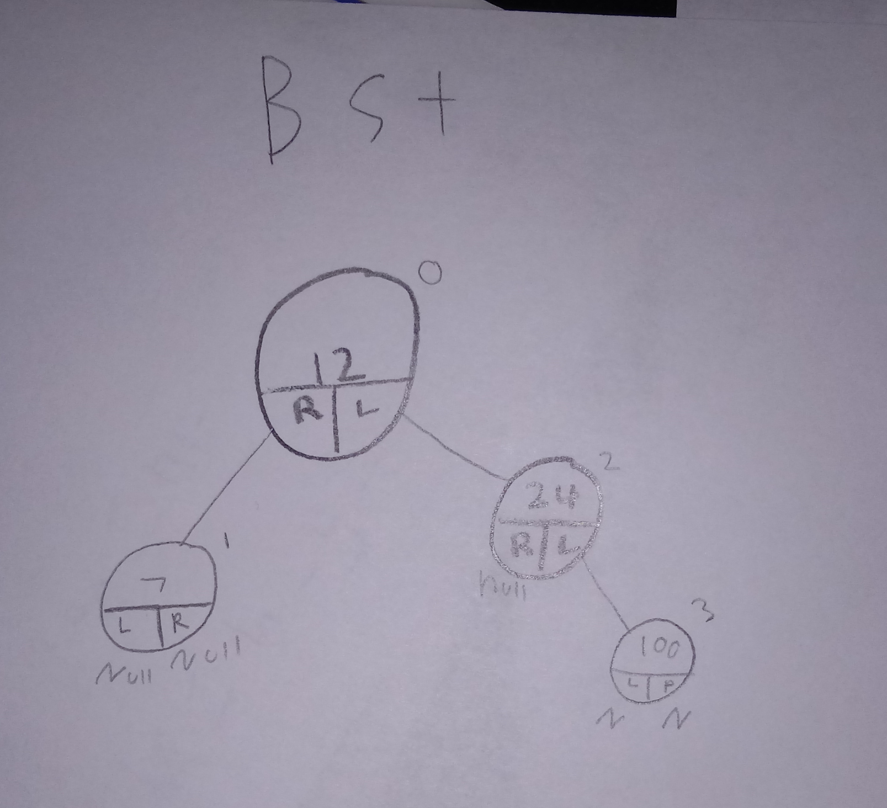

# Binary Search Tree

A binary Search Tree is a data structure in which objects are sorted in the following manner. It sorts the tree starting from the root node. If a new value is added and it is greater then the root,it is added to the right. If the node's value is less then the root then it is added to the left. Becuase of recurtion,any BST node can be a root.    


# In Memory

In memory, a \[widget\] looks like this:



\[This is a diagram of a binary search tree in memory. Each node has a pointer to the left and right. If there is no child, then the pointer value is null. ]

# Operations

A \[widget\] supports the following operations:

* The efficiency of accessing/searching a Binary Search tree is Big O(n). because an inefficient BST will degrade into a linked list like structure.  
*  The same goes for the efficiency of insertion/deletion in a Binary Search tree is Big O(n) because of linked list like Imbalances .   

* name: description, Big O efficiency, and explain why / what that 

# Use Cases

a binary search tree, if values are distributed properly, can be O(log(n)) which is more efficiency than a linked list. This makes it useful for searching accessing and searching. 

However, other types of trees that self-balance are much more effective and safer in terms of efficiency.   
 

It is not as good as \[what] \[why\].

# Example

```
sample code showing creation, and exercising all of the operations
or
a program that doesn't use the structure, and then a version that does
```

(c) 2018 YOUR NAME. All rights reserved.
