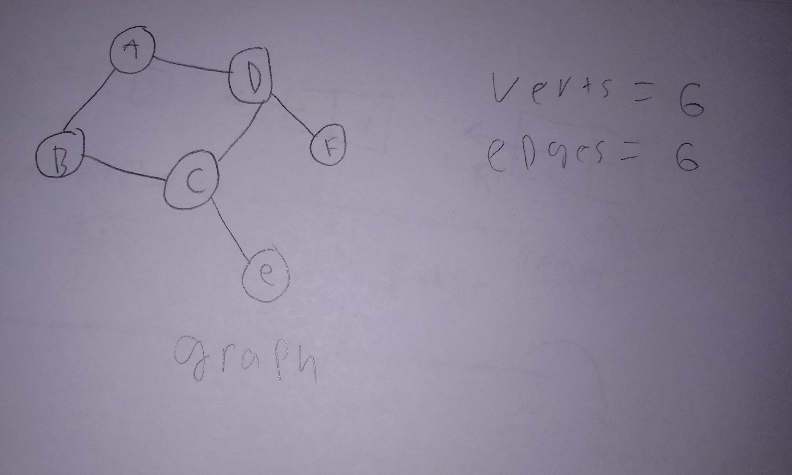

# Graph

A graph is a nonlinear data structure that uses nodes and are connected with edges. A graph can best be best defined with the following equation. G = (V,E) Where a graph G is an ordered pair of a set of vertices V and a set of edges E. 

In a graph using a directed edge, each edge would be represented using an ordered pair starting at the origin and ending at the destination. In a directed graph, one way traversal from origin to destination is only allowed.  In an undirected graph, the edges would be represented as a set and traversal could happened both ways. A graph can sometimes be broken into small parts and each separate part is called a component. Also, a graph where the starting vertex is the same as the ending vertex is called cyclic. There are a few different ways to implement a graph, one way would be to use an adjacency list.   
# In Memory

In memory, a graph looks like this:

\[sketch or diagram\]

This is a diagram of a graph with 6 vertices and 6 edges 

# Operations

A \[widget\] supports the following operations:

* Using an adjacency list, adding a vertex or adding an edge is o(1).
The complexity of deleting a vertex is depended on the number of vertices or O(V) and deleting an edge is O( E ) dependant on the number of edges. 
* The complexity of deleting a vertex is depended on the number of vertices or O(V) and deleting an edge is O( E ) dependant on the number of edges. 


# Use Cases

Graphs can be used in many applications like networking, mapping out roads, and finding short paths.

Because of the complexity of setting up a graph, a simple basic low data project won’t want to use one. 


# Example

```
test =  graph()
test.add_edge(x,y)# given the location,this makes a new edge.
test.add_vertex(x,y)# given the location,this makes a new edge vertex.

```

(c) 2018 YOUR NAME. All rights reserved.

