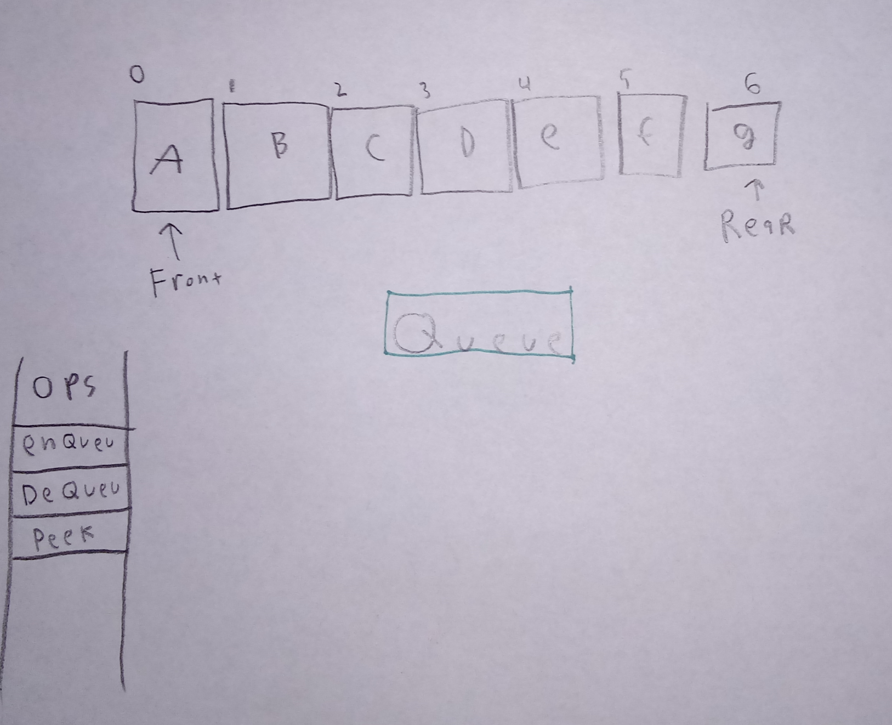

# Queue

A \[queu] is a liner data structure in wich items can only be inserted (enqued) at the tail end and elements removed(dequed) at the front or head. a queue is a Last-In-First-out (LIFO) data type and does not provid random access. 

# In Memory

In memory, a \[widget\] looks like this:





# Operations

A \[widget\] supports the following operations:

* Accessing and searching a queue is O(n) because a queue can only be dequeued 1 element and at time, it may have to iterate across the entire queue to find the search value, so, it is O(n).  
* insertion and deletion of a queue better known as enque and dequeue, are O(1) because they occur at fixed positions at the tail and at the head respectively so iteration is not needed.  

# Use Cases

An Queue is good for many cases, in general, a queue is useful for creating a list of operations or elements where resources are limited or order matters. Like ,creating a queue for a printer,online waiting list ect. 

a Queue is not very usefull when radmond acces is needed or values outside of the head or tail are needed quickly because that would be inefficient and require iteration.


# Example

```
sample code showing creation, and exercising all of the operations
or
a program that doesn't use the structure, and then a version that does
```

(c) 2018 YOUR NAME. All rights reserved.
