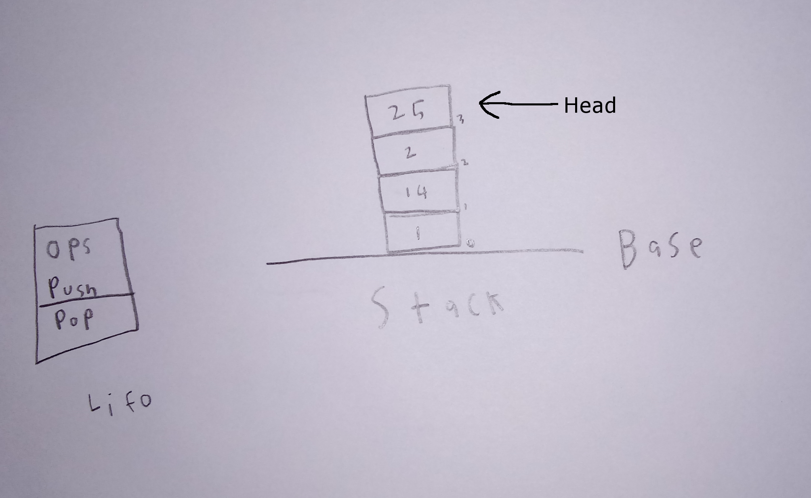

# Stack

A stack is an ordered collection of elements in which items are either added (push) or removed (pop) from only one end. A stack is a Last-In-First-Out structure or (LIFO) and elements cannot be added or removed anywhere but the top. 

# In Memory



# Operations

A \[widget\] supports the following operations:

* The efficiency of push and pop are both O(1) because they both only can be added/removed from the head and no iteration is needed.
* The efficiency of accessing and searching a stack is o(n) because iteration is needed from the top to the search value.    


# Use Cases

* Because pushing onto a stack is O(1), A great use for a stack would for collecting tons of data for later analyses. 

* A stack would not be very useful if you wish to frequently search threw the stack for a specific element, this would be better handled with an array.   


# Example

```
Foo = Stack() #creates a new stack 
Foo.push("hello")
Foo.push("hi")
Foo.push(True)
Foo.pop()
print(Foo.Peek())

```

(c) 2018 YOUR NAME. All rights reserved.
