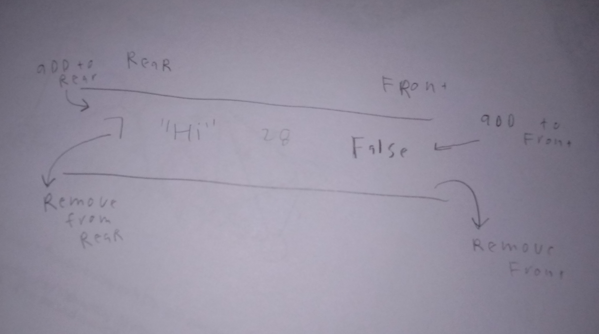

# deque

A deque is a type of queue that is double ended in which elements can be inserted in either the head of the tail. Because of this, a deque doesn’t follow a perfect LIFO or FIFO structures and is up to the implementor in which should be used..

# In Memory

In memory, a \[widget\] looks like this:



\[description of diagram\]

# Operations

A \[widget\] supports the following operations:

* An array implementation’s complexity for pushing(enque) and popping(deque) at either end of deque is O(1). 
* searching for a value in a deque is O(n) because iteration is needed. 

# Use Cases

A deque is useful when needing to push and pop from both ends of a list. Some applications would be to store search history and to store a list of undo history and then deque at a certain point. 

A deque is not very useful when order matters or for searching or indexing. 

# Example

```
test = deque() # makes a new deque

test.append(1) # this adds to the right side of a deque
test.appendleft(2) # this adds to the left side
test.pop(1)# removes from right side
test.popleft(2) #removes from left side

```

(c) 2018 YOUR NAME. All rights reserved.

