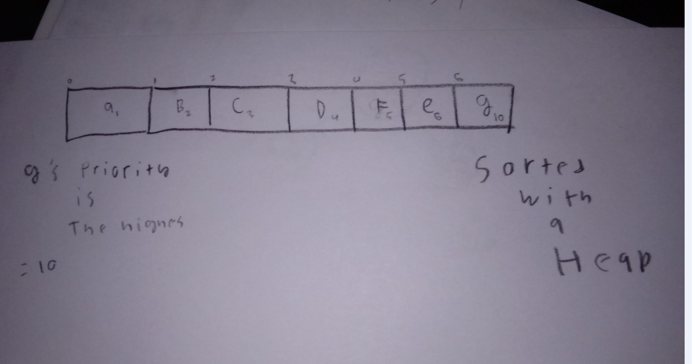

# Priority Queue

 A priority queue is similar to a regular queue, but in a priority queue each element has a value that corresponds to a priority level. If an element has a higher priority, then the highest priority gets to the front of the queue first. This is done with the help of a binary heap. 

# In Memory

In memory, a \[widget\] looks like this:



\[description of diagram\]

# Operations

A \[widget\] supports the following operations:

* because a priority queue uses a binary heap, insertion and deletion of elements onto a priority que is O(log(n))
* searching and accessing a binary heap is O(n) because it is only partially sorted and it sill needs iteration.  

# Use Cases

 Because a priority queue uses a binary heap, insertion and deletion of elements onto a priority que is O(log(n)).

A priority queue would not be useful when all elements have the same priority or that the priority feature is not needed.   

# Example

```
test = PQ()
test.insert("hello",2)# adds a value with a priority of 2
test.insert("from the",10)# adds a value with a priority of 10
test.insert("other side",20)# adds a value with a priority of 20

```

(c) 2018 YOUR NAME. All rights reserved.

