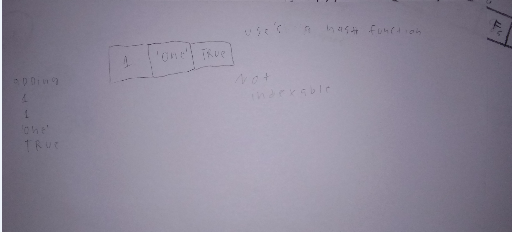

# Set

A set is a collection of various elements which can be different data types.In a set, there can be no duplicates.In a set the order does not matter as it is not indexable. 

# In Memory

In memory, a \[widget\] looks like this:

\[sketch or diagram\]



# Operations

A \[widget\] supports the following operations:

* Because the python set uses a keyless hash table, insertion and deletion and search(hasValue()) are O(1). 


# Use Cases

A few uses for a set are to compute math operations like union and difference equations, removing duplicates from a sequence.

a set would not work if you need to index a value in a set.

# Example

```
    
test = set()
test.add("hello")
test.add(True)
test.add(135)
test.add("hello")# this wont add anything new because there is already an element named "hello"
print(test)
print(len (test))
test.discard(135)# this removes 135
print(test)

```

(c) 2018 YOUR NAME. All rights reserved.

